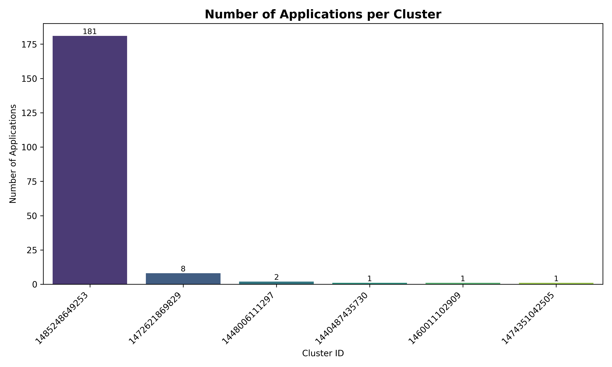
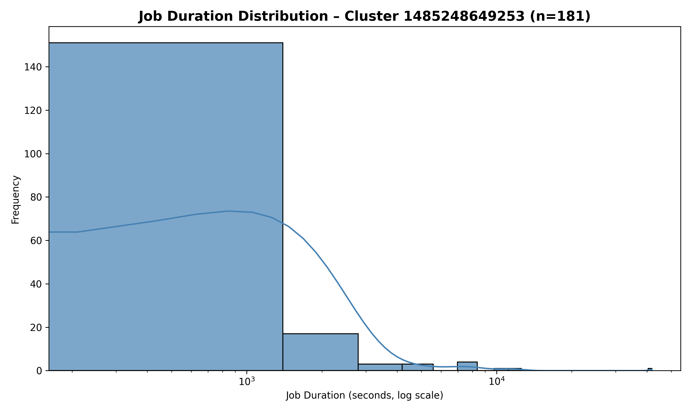
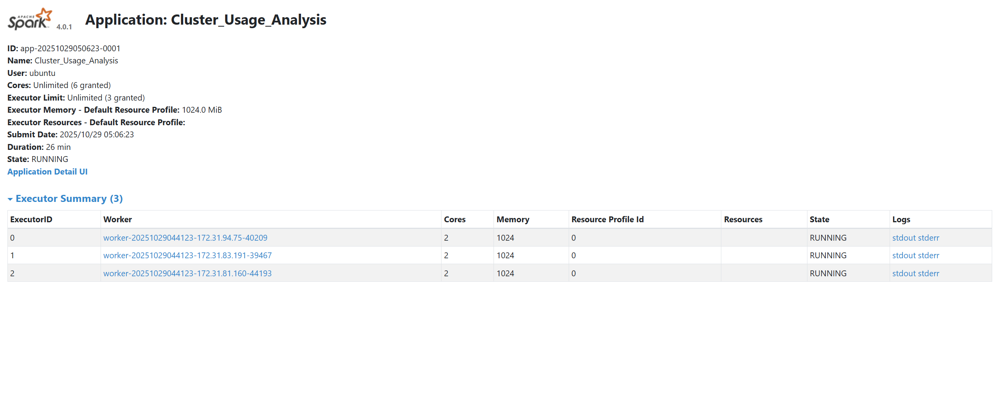
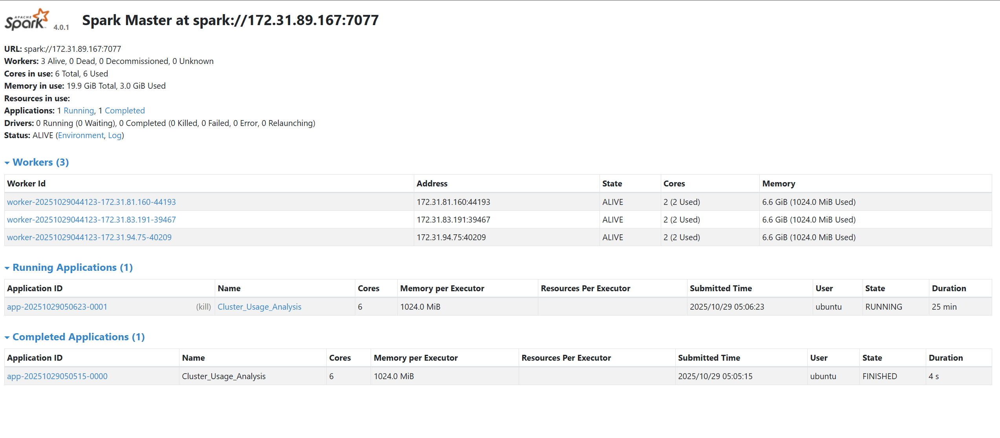

# Spark Log Analysis – Analysis Report
## Author: CJ Jones

## 1. Overview

This project analyzes **Apache Spark cluster logs** (≈2.8 GB) using **PySpark** on a distributed AWS EC2 cluster.  
The goal was to extract structured insights from thousands of unstructured log files generated across 194 Spark applications, each corresponding to specific YARN cluster runs between 2015–2017.

---

## 2. Problem 1 – Log Level Distribution

- Implemented in `problem1.py` using **Spark DataFrame transformations**.  
- Each log file was read line-by-line, extracting the log level using a **regex pattern** (`\b(INFO|WARN|ERROR|DEBUG)\b`).  
- Aggregations were computed using `groupBy().count()` and persisted to CSV.  
- Random sampling of 10 log lines was generated for inspection using `orderBy(rand()).limit(10)`.  
- Output files were written both locally and to S3, automatically flattened to single CSVs via the Hadoop FileSystem API.

#### Summary

| Metric                         | Value        |
|------------------------------- |------------:|
| **Total log lines processed**   | 33,236,604  |
| **Total lines with log levels** | 27,410,336  |
| **Unique log levels found**     | 4           |

#### Log Level Distribution

| Log Level |      Count    |   Percent   |
|:----------|-------------:|------------:|
| INFO      | 27,389,482   | 82.41%      |
| *(blank)* |  5,826,268   | 17.53%      |
| ERROR     |     11,259   |  0.03%      |
| WARN      |      9,595   |  0.03%      |

**Interpretation:**
- The overwhelming majority of messages are `INFO` (≈82%), reflecting Spark’s default verbosity.
- Only 0.06% of total messages were `ERROR` or `WARN`, suggesting stable cluster operation.
- A significant fraction of log lines had no recognized level (blank), likely Spark system output or configuration noise.

---

## 3. Problem 2 – Cluster Usage Analysis

- Implemented in `problem2.py` using **Spark + Pandas hybrid pipeline**:
  1. **File Discovery:** Used Spark’s Hadoop FS API (`FileSystem.listStatus()`) to recursively list all log directories in S3.  
  2. **Timestamp Extraction:** Iterated through each log file to identify the **maximum timestamp** using a regex match on `YY/MM/DD HH:MM:SS`.  
  3. **Parallelization:** Leveraged Spark’s executors and `ThreadPoolExecutor` for concurrent S3 log reads.  
  4. **Data Enrichment:** Constructed DataFrames with derived columns:
     - `cluster_id` → extracted from `application_id`
     - `app_number` → per-cluster application counter
     - `datetime` → converted from Unix timestamp (ms)
  5. **Aggregation:**
     - Timeline DataFrame: per-application start & end times
     - Cluster Summary: number of applications, first and last execution
     - Stats Report: aggregate metrics on clusters
  6. **Visualization:** Created bar and density plots using **Matplotlib + Seaborn**.

#### Summary

| Metric                          | Value        |
|:---------------------------------|------------:|
| **Total unique clusters**        | 6           |
| **Total applications**           | 194         |
| **Avg. applications per cluster**| 32.33       |

#### Most Heavily Used Clusters

| Cluster ID        | Applications |
|:------------------|------------:|
| 1485248649253     | 181         |
| 1472621869829     | 8           |
| 1448006111297     | 2           |
| 1440487435730     | 1           |
| 1460011102909     | 1           |

**Interpretation:**
- **Cluster 1485248649253** accounts for ~93% of all applications — likely the primary compute cluster.  
- Other clusters appear sporadic, possibly representing test or one-off environments.
- The largest cluster’s jobs range widely in duration (from a few seconds to several hours).

---

## 4. Visualizations

### Bar Chart – Number of Applications per Cluster

**Description:**
- This visualization shows a **heavily skewed distribution** where one cluster dominates job submissions.
- Cluster `1485248649253` has **181 applications**, while the next largest has only 8.
- The imbalance suggests centralization of workload on a single cluster.

---

### Density Plot – Job Duration Distribution

**Description:**
- The histogram uses a **log-scale x-axis** due to large variance in durations.  
- Most jobs complete within a few thousand seconds (~15–60 minutes), with a long tail up to **10⁴–10⁵ seconds**.  
- A clear **right-skewed distribution** is visible — indicative of occasional long-running or stuck jobs.

---

## 5. Performance & Optimization Observations

| Aspect | Optimization | Effect |
|--------|---------------|---------|
| **I/O Parallelism** | Used Spark’s Hadoop FS API + multithreaded readers for timestamp extraction | Reduced S3 read latency significantly |
| **Serialization** | Enabled `KryoSerializer` for all Spark jobs | Improved executor communication performance |
| **Adaptive Query Execution (AQE)** | Enabled `spark.sql.adaptive.enabled` | Dynamic coalescing of partitions for optimal shuffle |
| **DataFrame Caching** | Persisted intermediate frames (`df_levels`) in Problem 1 | Prevented re-read of raw logs |
| **Driver–Executor Overhead** | Kept small aggregates in memory and collected once | Prevented unnecessary cluster shuffles |

**Execution Time Observations:**
- **Problem 1:** ~4 minutes (full dataset, 33M lines)
- **Problem 2:** ~14 minutes (194 applications, ~3.8K log files)
- Spark Web UI confirmed efficient stage coalescing and executor utilization.

---

## 6. Spark Web UI Screenshots

Include Spark Web UI screenshots showing key execution stages:

 

*(Place your actual screenshots in `./screenshots/` directory and update links.)*

---
